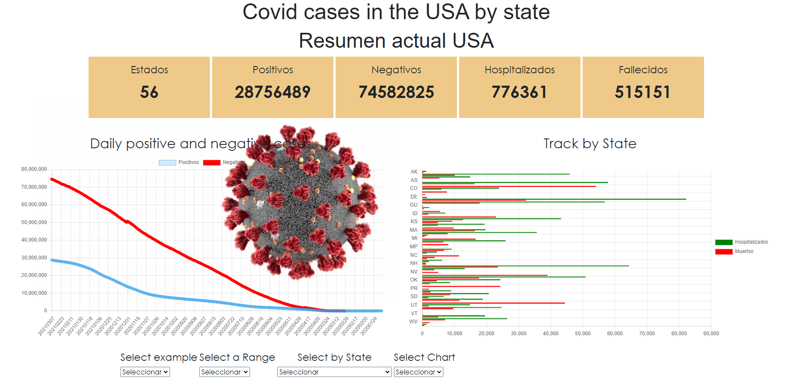

# PROYECTO 3: DASHBOARD

## Tecnologias utilizadas

En este proyecto se utilizaron las siguientes tecnologias:

- HTML5
- CSS3
- JavaScript
- Async - Await
- API's
- funciones fetch()
- Try - Catch
- Git con GitHub
- y mas tecnologias...

## ENLACES

Enlaces de interes para el proyecto.

- Repositorio: https://github.com/JesusFz93/UCamp-03-dashboard
- Pagina publicada: https://jesusfz93.github.io/UCamp-02-crud/
